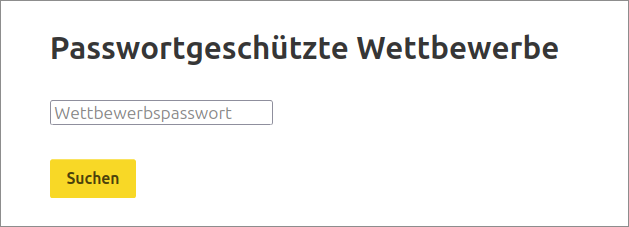

# Öffentliche Aufgaben für die Wettbewerbsplattfom [jwinf.de](https://jwinf.de/)

Dieses Repository enthält die öffentlichen Aufgaben für die Programmierwettbewerbsseite [jwinf.de](https://jwinf.de/).

Dieses Repository ist im [BWINF Gitlab](https://git.bwinf.de/bwinf/jwinf-aufgaben-public) und auf [Github](https://git.bwinf.de/bwinf/jwinf-aufgaben-public) erreichbar.

Pull-Requests / Merge-Requests zum Hinzufügen eigener Aufgaben sind möglich und erwünscht!

- Trainingsaufgaben die als Vorlage für eigene Aufgaben fungieren können finden sich unter `training/`.
- Minimale Beispiele für Aufgabensammlungen und einzelne Aufgaben finden sich unter `beispiel/`.
- Eigene Aufgaben und Aufgabensammlungen können unter `user/` angelegt werden.

Für Fragen kann [im Gitlab ein Ticket](https://git.bwinf.de/bwinf/jwinf-aufgaben-public/-/issues) oder [auf Github ein Issue](https://github.com/bwinf/jwinf-aufgaben-public/issues) angelegt werden

## Inhalt

- [Struktur einer einzelnen Aufgabe](#struktur-einer-einzelnen-aufgabe)
- [Struktur einer Aufgabesammlung](#struktur-einer-aufgabesammlung)
- [Veröffentlichen von Aufgaben](#veröffentlichen-von-aufgaben)
- [Lokale Entwicklung der Aufgaben](#lokale-entwicklung-der-aufgaben)


## Struktur einer einzelnen Aufgabe

Eine Aufgabe besteht üblicherweise aus drei Dateien:

- `index.html` für die Texte der Aufgaben
- `task.js` für die Aufgabenlogik
- `task.yaml` für Metadaten

zusätzlich können noch weitere Dateien, wie z. B. Bilder zu einer Aufgabe gehören.

### task.yaml

Eine `task.yaml` für eine Aufgabe kann z. B. so aussehen

```YAML
standalone: true

name: "Name der Aufgabe"
secret: apfel

languages:
  - blockly
```

- `standalone: true` muss gesetzt werden.
- `name:` setzt den Namen der Aufgabe.
- `secret: apfel` vergibt ein Wettbewerbspasswort mit dem die Aufgabe auf [jwinf.de](https://jwinf.de) gefunden werden kann.
- `languages:` gibt die Liste der Programmiersprachen für die Aufgabe an. Mögliche Werte sind `blockly` und `python`.

### Beispiel

Unter `beispiel/Turtle-Aufgabe_einzeln` findet sich ein Beispiel für eine einzelne Aufgabe mit einer `task.yaml`.

## Struktur einer Aufgabesammlung

Es können mehrere Aufgaben zu einer Aufgabensammlung ('contest') zusammengefasst werden. Die einzelnen Aufgaben brauchen dann keine `task.yaml` (aber sie schadet auch nicht).

Eine Aufgabensammlung besteht aus einer `contest.yaml`, die mehrere Augaben zusammenfasst.

### contest.yaml

Eine `contest.yaml` kann einen beliebigen Namen haben, muss aber auf `.yaml` enden und darf nicht `task.yaml` heißen.

Sie kann z. B. so aussehen

```YAML
category: public

name: "Name des Wettbewerbs"
secret: apfel
duration_minutes: 0

language: blockly

tasks:
  "Name der ersten Aufgabe":
    "ersteAufgabe/index.html": {stars: 4}
  "Name der zweiten Aufgabe":
    "zweiteAufgabe/index.html": {stars: 4}
```

- `category: public` muss gesetzt werden.
- `name:` setzt den Namen des Wettbewerbs.
- `secret: apfel` vergibt ein Wettbewerbspasswort mit dem der Aufgabensatz auf [jwinf.de](https://jwinf.de) gefunden werden kann.
- `duration:` muss gesetzt werden und gibt die Zeit (in Minuten) an, für die ein Teilnehmer den Aufgabensatz bearbeiten kann. Ein Wert von 0 erlaubt unbeschränkte Bearbeitung.
- `language:` gibt die Programmiersprachen für die Aufgaben an. Mögliche Werte sind `blockly` und `python`. Im Gegensatz zu den einzelnen Aufgaben kann hier (zur Zeit) nur ein Wert angegeben werden.
- `tasks:` beschreibt die einzenen Aufgaben die zu dem Aufgabensatz gehören.

### Beispiel

Unter `beispiel/aufgabensammlung.yaml` findet sich ein Beispiel für eine Aufgabensammlung bestehend aus zwei Aufgaben.

## Veröffentlichen von Aufgaben

### Aufgaben hinzufügen

Neuen Aufgaben können im Verzeichnis `user` angelegt werden. Bitte im Verzeichnis `user` einen eigenes Verzeichnis mit dem eigenen Namen / Nutzername anlegen, z. B. `user/RobertCzechowski` oder `user/zgtm`.

### Pull request / Merge request erstellen

Um die Aufgaben zu veröffentlichen kann [auf Github ein Pull Request](https://github.com/bwinf/jwinf-aufgaben-public/pulls) oder [im Gitlab ein Merge Request](https://git.bwinf.de/bwinf/jwinf-aufgaben-public/-/merge_requests) erstellt werden. Diese werden dann von uns geprüft und zeitnah bearbeitet.

### Aufgaben auf jwinf.de aufrufen

Damit die Aufgaben auf [jwinf.de](https://jwinf.de) gefunden werden können, sollte ein Wettbewerbspasswort (`secret`) gesetzt werden..

- Unter https://jwinf.de/contest/public?secret= können die die Aufgabensammlungen dann nach dem Passwort gesucht werden.
- Unter https://jwinf.de/contest/standalone_task?secret= können einzelne Aufgaben nach dem Passwort gesucht werden.



Alternativ kann unter `https://jwinf.de/contest/?secret=<passwort>` direkt auf alle Aufgaben mit dem Wettbewerbspasswort `<passwort>` verwiesen werden. Ist als Wettbewerbspasswort z.B. `beispiel` gesetzt:

- https://jwinf.de/contest/public?secret=beispiel listet die Aufgabensammlungen mit dem Wettbewerbspasswort `beispiel` auf.
- https://jwinf.de/contest/standalone_task?secret=beispiel listet einzelne Aufgaben mit dem Wettbewerbspasswort `beispiel` auf.

Wenn es mehrere Aufgaben mit dem gleichen Passwort gibt werden alle dort angezeigt.

Hinweis: Dieses Passwort bietet keine Sicherheit, dass die Aufgaben nicht von anderen gesehen werden können, da die Passwörter in diesem Repository im Klartext auffindbar. Wir empfehlen einfache Passwörter aus Alltagswörtern oder Schul-/Lehrkraftnamen. Kleinschreibung der Passwörter hilft Falscheingaben zu vermeiden.

## Lokale Entwicklung der Aufgaben

### Fork erstellen und klonen

Um eigene Aufgaben oder Aufgabensätze zu erstellen muss zunächst ein Fork des Repositories erzeugt werden und dieser lokal geklont werden. Für das klonen wird ein Account auf [Github](https://github.com) oder im [BWINF Gitlab](https://git.bwinf.de/) benötigt. Lehrkräfte mit einem [AMS-Account / BWINF-Login](https://login.bwinf.de/) können sich mit diesem auch im BWINF Gitlab anmelden; beim Login unten auf "BWINF-Login" klicken.

### Repository einrichten

Zunächst muss dieses Repository lokal geklont werden.

Für das lokale Ausführen der Aufgaben muss das Git-Repository
[bebras-modules](https://github.com/bwinf/bebras-modules) als `../_common/modules/` erreichbar sein.

Außerdem muss der Branch `jwinf` von [bebras-modules](https://github.com/bwinf/bebras-modules) ausgecheckt werden!

Auf der Kommandozeile geht dies z. B. durch Ausführen des folgenden Kommandos:

```
git clone https://github.com/bwinf/bebras-modules _common/modules -b jwinf
```

Die Verzeichnisstruktur muss dann so aussehen:

```
┌───┐     ┌───────────────────────┐     ┌─────────────┐
│ . │ ─┬─ │        _common        │ ─── │   modules   │
└───┘  │  └───────────────────────┘     └─────────────┘
       │  ┌───────────────────────┐
       └─ │ jwinf-aufgaben-public │
          └───────────────────────┘
```
